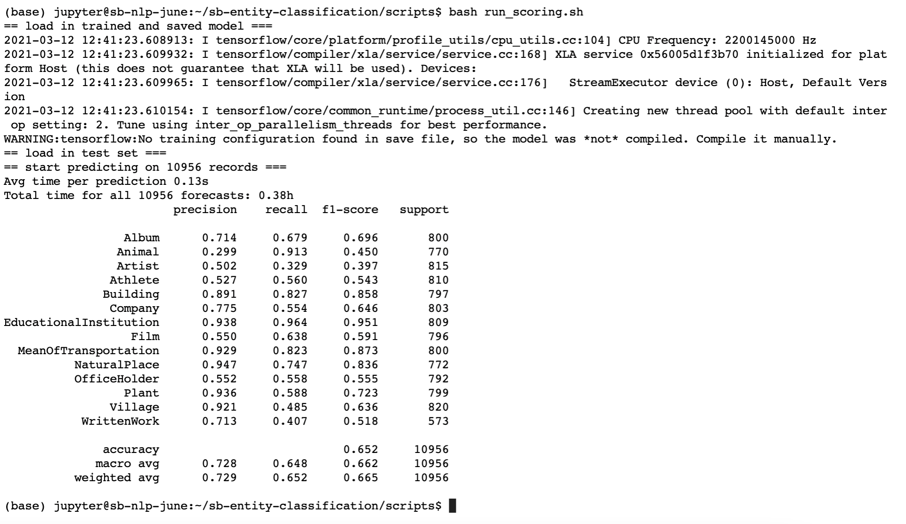

## About this Project

The task for this project is to classify names (based on texts of names only) into 14 non-overlapping classes.

**A few musings on the set-up of the task itself**:
1. The distribution includinng the few noted specificities in the supplied dataset will be _assumed_ to mirror distribution of the dataset that the ML application will be deployed on, i.e. what's expected of customers' input. The noted specificities include (1) presence of non-ascii words is highly uneven across classes; (2) names for classes plant and animal are mainly their scientific Latin names. If this assumption is violated, then collection of more diverse data points  should be pursued to ensure generalizability of the model.
2. There are three distinct classes in the brief that are human names, namely (puns unintended),artist, athelete, and office holder. Without explicit profession sometiumes supplied in parathensis within 'name' or additional contexts of external datasets, one's name should not contain information that reasonably and fairly implies one's profession. Therefore, depending on how the output is exposed to the user, when a profession is not included in the 'name' field, perhaps the model should only output a class called 'human names' rather than the attempted prediction of profession based on whatever spurious associations or biases there may be in training data.


**A few things to try if having more time**:
1. Model fine-tune: through experiments of different NN architecture and hyper-parameter tuning; for baseline xgboost model, scale input features and experiment with different ways of encoding categorical features (for example, label encoding, or target encoding).
2. A Mega-model: combine (for instance, concatenate) handcrafted features with embeddings as features to train another NN to see if the information contained in them complement each other;
3. Stacking models: earlier baseline model experiments with only statistical or keyword features indicated that a model trained with different set of features were particularly good at classifying certain classes. It may be that a multi-step approach where the classification of 14 steps are broken down into several sequential tasks, depending on similarity of the classes, would perform better.
4. Ensemble learning, as an alternative to 3.
5. Thorough model performance evaluation (debugging of ML behavior): e.g. analysis into performance for each class, ad-hoc analysis into whether the model may have exploited the biased distribution between classes as identified in EDA, sensitivity analysis on presence of non-ascii characters.
6. Refactor the code for the winning model, export and deploy model on GCP AI Platform.
7. More delicate handling of non-english and non-ascii characters.

**What would also be interesting but is out of scope for this task**:
1. Contextual information in addition to the names themselves. Recent advances in NLP have been fueled by contextual language models such as transformers, ELMO, BERT, GPTs, which are typically useful when contexts are abundant, i.e. when sentences and paragraphs are provided in addition to the names alone. 

## Getting Started

```make init```


## Contents
#### data
This directory contains downloaded data, including classes.txt, data.csv as shared by SB, and the downloaded glove.6b pretrained embeddings.

#### images
Screenshots

#### models
This directory contains saved, trained models

#### notebooks
This directory contains 5 complete notebooks.
1. 01-EDA.ipynb
This notebook records efforts to audit data quality and distribution, familiarize with examples for texts to be classified, exploration of a few 'quirks' observed in data. The explored characteristics of names and classes informed engineering of statistical and keywords features for baseline model. Comments on data are documented within the notebook.

2. 02-EDA-NER.ipynb
This notebook explores efficacy and relevance of SpaCy's out-of-the-box 'named entity recognition' component for this task. This informed engineering of 'ner' features for baseline model. Comments on data are documented within the notebook. 

3. 03-model1-baseline.ipynb
This notebook attempts a baseline model (using xgboost classifier), based on handcrafted features explored in the two EDA notebooks.  

4. 04-model2-nn-training.ipynb
This notebook utlizes the pretrained GloVe word embedding, and deep neural net to classify names in an end-to-end manner.

5. 05-model2-nn-scoring.ipynb
This notebook loads the saved, trained model and artifacts to be able to score on a test set. Note that code for this part has been turned into scripts/score_with_nn.py 


#### scripts
This directory contains two files at the moment.
1. run_scoring.sh

2. score_with_nn.py 

The bash file `run_scoring.sh` triggers `score_with_nn.py` and supplies path to the models and artifacts as parameters. A screenshot of test set performance is attached below.


#### tests
Directory for future population of tests.

#### utils
Directory for future refactoring of code.


